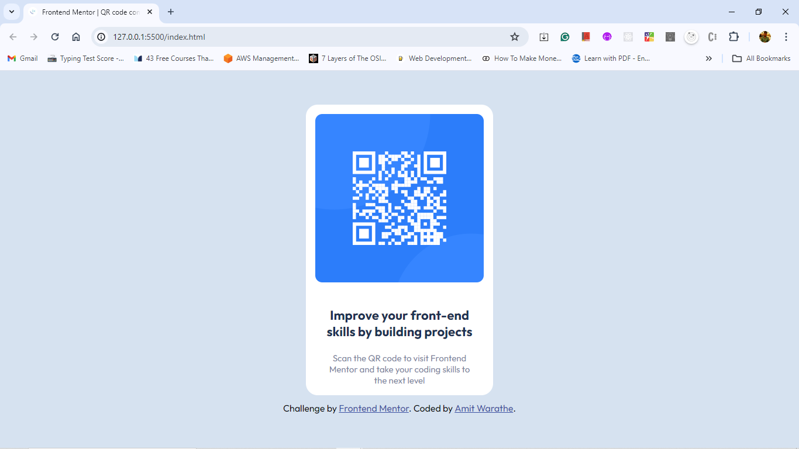

# Frontend Mentor - QR code component solution

This is a solution to the [QR code component challenge on Frontend Mentor](https://www.frontendmentor.io/challenges/qr-code-component-iux_sIO_H). Frontend Mentor challenges help you improve your coding skills by building realistic projects.

## Table of contents

- [Overview](#overview)
- [Screenshot](#screenshot)
- [Links](#links)
- [Built with](#built-with)
- [What I learned](#what-i-learned)
- [Author](#author)

**Note: Delete this note and update the table of contents based on what sections you keep.**

## Overview

This is a QR-code component page project made with using HTML and CSS.

### Screenshot

### Links

- Solution URL: [https://github.com/amitw-19/QR-code]
- Live Site URL: [https://payment-qr.netlify.app/]

### Built with

- Semantic HTML5 markup
- CSS custom properties
- Flexbox

### What I learned

IN the process of building this project i learned about the below things -

- HTML elements
- Defferent CSS properties such as FlexBox, margin, padding, display, text-align etc.

## Author

- Website - [Add your name here](https://www.your-site.com)
- Frontend Mentor - [@amitw-19](https://www.frontendmentor.io/profile/yourusername)
- Twitter - [@yourusername](https://www.twitter.com/yourusername)
